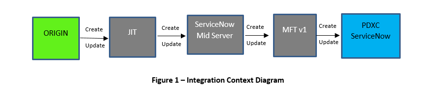

# <u>DXC ServiceNow Integrations Origin to ServiceNow People Data Release 1.0</u>

## **<u>Table of Contents**</u> 
* References
* [Summary](#Summary)
  * [Business Requirements](#Business)
  * [Design Requirements](#Design)
    * [Interface Context](#interface)
    *  [Detailed Interface Components - Context](#detailed)
* [Configuration](#Configuration) 
   *  [Configuration Assumptions](#Config1) 
   *  [Configuration Requirements](#Confi2)
      *  [Origin](#Config3) 
* [Origin ServiceNow File to DXC ServiceNow Integration Process Overview](#ORIGIN) 
   * [The Origin User Record Receiving File](#user) 
   * [MID File Transfer / SNOW Import Set Process](#mid)
   * [Business Service Integration](#BSI)
   * [Create or Update Origin People Record in ServiceNow](#create)
   * [Origin ServiceNow File to DXC ServiceNow Users Integration Process Rules](#dxc) 
   * [Import Set table and Transform Map](#import) 
     * [Origin](#origin1) 
  * [Matching Key –Origin ServiceNow File to DXC ServiceNow](#matching) 
* [Exception Handling](#Exception)
   * [Data Issue](#data) 
   * [Connectivity Issue](#issue)


### **<u>Reference</u>**

| NO | Author | Document Title/Filename/Source Repository |
|----------|:-------------:|:------------------|
| 1 | Basu Debarata | DXC-Origin-DMW-ServiceNow (People) v.04 |
| 2 |    Basu Debarata  |  GIS-ARCH-ICD ORIGIN ServiceNow to ServiceNow User_Foundation v0.2 |


<a name="Summary">

###  **<u>Summary**</u>
</a>

<a name="Business">
**Business Requirements**
</a>

  This design document describes the requirements from a ServiceNow perspective. This document captures the detail design of the Origin People standalone integration into ServiceNow via a MIDServer and JIT. The design utilizes ServiceNow, MID File Transfer using the Management, Instrumentation and MID Server and JIT.

This design document will describe the fields and data that will pass or be passed from the MID Server to ServiceNow and how ServiceNow will handle incoming transactions.

The relevant transactions for ORIGIN to Commercial ServiceNow are:

    * Initial load of people data from ORIGIN to DXC ServiceNow as part of on-boarding batch process.

    * On-going maintenance of people data from ORIGIN to ServiceNow as a daily batch process (this may be the same process that is used in the initial load).


<a name="Design">

 **<u> Design Requirements**</u>
 </a>

 <a name="interface">

  * <u>Interface Context</u>
</a>

 

 The integration between ORIGIN and PDXC ServiceNow is a file data exchange integration. It is a uni-directional integration in which data flow happens through file extract from ORIGIN to PDXC ServiceNow. ORIGIN provides the people data in a file for new and updated records 

 <a name="detailed">
 
 * **<u>Detailed Interface Components - Context**</u>
 </a>

 

 The Interface diagram illustrates the interaction between PDXC ServiceNow and ORIGIN. A subscription (Job) will be scheduled in ORIGIN that queries and extract new and updated user information and formats the output as per standard and pushes the data into SFTP Server. The Scheduled Data extract job in Mid Server extract the information from the files and pushes it to MFT (Mid File Transfer) which is further processed through transform maps into User Table of PDXC ServiceNow.
The extraction options should support two extract options which can be switched on

•	Full extract (default option) – used to load all people from ORIGIN to ServiceNow.

•	Partial extract – used to load only people just created or updated since the specific time (filter the queries based on last updated).

<u>ORIGIN team to ensure</u>

* Subscription to extract data from ORIGIN will contain Full records (new and updated) of user data and the partial loads will be done.
* File is placed on the agreed folder and its location on SFTP Server (JIT environment). 


| Affected Tool/Component | Description | 
|----------|:----------:|
| Transformation Map on ServiceNow| Transformation Map will map and transform data from MFT to the target table.|
| Data Import Set |    Data Import Set provides tables that are a staging area for the retrieved data which is ready for comparison and transformation.  |
|MFT v1 | Mid File Transfer is a custom application within PDXC ServiceNow. It executes a batch script on MID server (by sending a topic “Command” to ECC queue) to pull the specified file from remote site (JIT / FTP server) to local folder of MID server, then read file-content and return it to response payload of ECC queue.|
|MID Server | This server acts as an agent which gets commands from ServiceNow and then execute them to do specific jobs. In this case, MID server will retrieve the file from JIT, read the file and then provide the data to ServiceNow through MFT.Mid Server to ensure that file is uncompressed from “zipped” format as well as decrypted prior to processing into MFT v1. Please refer to “Security Requirements” section for more details.|
|SFTP Server |DXC internally transfers files to other applications with the use of a leveraged service called JIT. These are secure file transfer (SFTP).|
|ORIGIN Data Extract | It extracts the user data from ORIGIN into files and pushes to the SFTP server.|
|Scheduled Batch Job| The people data load between the ORIGIN to ServiceNow is tracked by Scheduled Job. This will be run as schedule that configured at specific time.|

<a name="Configuration">

### **<u>Configuration</u>**
</a>

The configuration assumptions and requirements considered during the design of the integration, and any additional tool, configuration requirements.

<a name="config1">

Configuration Assumptions:
```
* A MID server is deployed and configured correctly on working with the ServiceNow instance.

* JIT can directly connect to the SFTP server.
```
</a>

<a name="config2">

* **<u> Configuration Requirements**</u></a>

An appropriate ServiceNow Business Service Integration is defined:

<a name="config3">

 **<u>ORIGIN**</u></a>
 ```
Name              -  Origin-People-Import-Integration

Company		      -	 Origin Energy

Service Classification	-	Integration Service

Approval Group		-	<TBD>

Support Group		-	<TBD>

Integration Name	-	Origin People Import

File Type		- Origin_People_User_Import

File Name		-	people.csv

Calendar Type		-	Daily (to be confirmed)

Run Time Zone		-	CEST (to be confirmed)

Run Hours		-	9am (to be confirmed)
```
<a name="ORIGIN">

### **<u>ORIGIN ServiceNow File to DXC ServiceNow Integration Process Overview</u>**
</a>

<a name="user">

* **<u>The ORIGIN User Record Receiving File**</u></a>

The following diagram illustrates the in-bound process described above and shows the “Script Includes”, “Business Rules” and “Script Actions” involved.


<a name="mid">

* **<u>MID File Transfer / SNOW Import Set Process**</u></a>

The process of receiving the ORIGIN user record file happens in the following way:
* An existing MID File Transfer configuration record is invoked manually, per schedule. The content of the “Script to Run” field is executed. This is usually:
```
(new MIDTransferRun(null, current.sys_id)).start();
```
This creates an instance of a MIDTransferRun class passing the MID File Transfer record to its constructor. The MIDTransferRun class and its helper classes handle the transfer regardless of whether it is in-bound or out-bound. 
Note that “MIDTransferRun” can be sub-classed for specialised transfers which could alter the flow of the following process. By default, depending on whether it is an in-bound or out-bound transfer the following steps are executed by MIDTransferRun and/or its helper classes:
Receiving file:
* ServiceNow places a command in the ecc queue that invokes the configured command on the MID server. This is usually a batch file (“SFTPTransferInAndUnzip.bat”) that acquires the file and returns the file content in the “ecc_queue”.
*	The batch command will connect to the host system over SFTP and pull the file. Once the file has been received, the file will be unzipped.
*	The “MID File Command Response” business rule detects the file content in the “ecc_queue” and either continues processing OR raises and incident if an error occurred during the transfer. 
*	The integration splits the file content into rows and columns, transforms the data, and feeds the data into the import set.
*	The data from the import set is imported into ServiceNow.

<a name="BSI">

* **<u>Business Service Integration**</u></a>

The “MID File Transfer” mechanism includes an optional set of script includes for integration with the “Business Services” form. They all have an “_BS” to distinguish them from the class they are overriding:

* MIDTransferRun_BS
The scripts have access to a “Business Service” record that contains the following variables that drive their behaviour:
```
  * “Caller”, ‘category’, ‘subcategory’ & ‘Assignment group’ – use the standard ‘mid file transfer’ incident template 
  *	“File name” – Split at the last “.” to provide “%FILENAMENOEXT%” and “%FILEEXT%”.
  *	“Calendar type” – Selects an entry from the “u_billing_cycle” table.
  *	“Run time zone (GMT/UTC)” – Determines the time zone associated with the selected calendar.
  *	“Run hours” – Used to specify one or more hours of the day to run (comma separated)

  ```
<a name="create">

* **<u>Create or Update ORIGIN People Record in ServiceNow**</u></a>

The ORIGIN to ServiceNow integration will load people data from ORIGIN ServiceNow File to DXC  ServiceNow system. This loading will be executed via Scheduled Job in ServiceNow Mid File Transfer area.
The ORIGIN to SNOW Integration will also be used to query to identify any additional users or any attribute modifications to existing user records, and to add the users or selectively update those attributes in SNOW.
To determine if a record needs to be inserted or updated, the following rules need to be applied,
•	If there is no match found, create a new user record.  
•	If a single match is found for the User ID, update the record.
•	The correlation / matching logic to be used against the User ID field in SNOW.

<a name="dxc">

  **<u>ORIGIN ServiceNow File to DXC ServiceNow Users Integration Process Rules**</u></a>

 * The scheduled job initiates transaction on MID Server by triggering the retrieval of the file from JIT over SFTP.
* 	If the ORIGIN file retrieval does not complete successfully, an incident is created and assigned to the ServiceNow Admin support group with details of the failure.
*	If the ORIGIN file returns new users that do not currently exist in ServiceNow, add these users to ServiceNow.
•*Referenced fields like location will be looked up within the company that was listed in the inbound record.
* If ORIGIN record doesn’t have a value for mandatory attributes, log this error to system log, and raise an incident. ServiceNow validates the data based on validations set up within the configuration in the Data Mapping Workbook. If this validation fails an error report will be attached to an incident assigned to the team as per the Integration Business Service for further investigation and discussion with the client.

  * <u>Mandatory Fields for ORIGIN</u>
```
* 	First name

* 	User ID
```
*	The people data load between the ORIGIN to DXC ServiceNow is tracked by Scheduled Job. This will be run as schedule that configured at specific time.
*	Company: Company should be always “Origin Energy” irrespective of the company name passed from input file.
*	Location: Origin Locations should be preloaded before ORIGIN users integration in place. The ORIGIN users integration process shouldn’t create new location in DXC ServiceNow system. If not found, the user record will be created with a default Location value.
*	User Id: Existing records are to be matched using the User ID value passed in with the input record from the flat file. 
*	Business phone: If a blank value is passed in then any existing value should be cleared.
*	Mobile phone: If a blank value is passed in then any existing value should be cleared.
*	Active: Active field in the input record will be a true/false and has to be mapped to servicenow active field with the same.
*	Notification: Notification should be set to disabled. This is of value 2 in ServiceNow.
*	Email: If email id is blank, the default email(no-email@originenergy.com.au) has to be set in servicenow.
*	VIP: If vip is blank, the default value “False” has to be set in ServiceNow.

<a name="import">

* **<u>Import Set table and Transform Map**</u></a>

The purpose of the Import Set table is to be a staging table that carry validation steps before data being transformed to the SNOW target table (“sys_user”).

<a name="origin1">

* <u>ORIGIN</u></a>

| Display Name | Field Name | Type | Max Length |
|----------|:-------------:|:------:|-------------|
| Active   | u_active      | String |  40 |
| Business phone |    u_business_phone  | String |40 |
|Email | u_email | String	| 100|
|First name	|u_first_name	|String	|50
|Last name|	u_last_name	|String	|50|
|Location|	u_location|	String|	100|
| Mobile phone|	u_mobile_phone|	String|	40|
|User ID|	u_user_id|	String|	100|
|VIP	|u_vip	|String|	40|
|Domain Username |	u_domain_username|	String|	256|

<a name="matching">

* **<u>Matching Key –ORIGIN ServiceNow File to DXC ServiceNow**</u></a>

Matching key for the ORIGIN User record to determine if a user record is new or existing in Service Now system.
* The matching criteria between ORIGIN and ServiceNow are Company and User ID.


<a name="Exception">

### **<u>Exception Handling</u>**
</a>

<a name="data">

* **<u>Data Issue</u>**</a>

The MID Server based on the retrieved user data objects and attributes from ORIGIN attempts to push the data to ServiceNow and fails due to a technical issue.
An Incident with the details of the errors will be created in ServiceNow and assigned to the CSC Technical Support Group as per the Integration Business Service for further investigation and resolution. Please configure to use an existing ‘Origin MID File Transfer Incident’ template. The information of incident is described as below:

|  |  |
|-----------|:-------------|
|Short description | \<Short description from ORIGIN User integration> |
| Work notes |	See attachment for more detail.|
| Category |	Integration |
|Subcategory|	Data|
|Assignment group|	\<Approval group from Business Service record>|
|Assigned to|	\<Owned by from Business Service record>|
|Company |	\<From ‘ORIGIN MID File Transfer Incident’ incident template> |
|Caller	|\<From ‘ORIGIN MID File Transfer Incident’ incident template>|
|Opened by| \<From ‘ORIGIN MID File Transfer Incident’ incident template> |
| Attachment  |\<Attached file contains error file> |


The attachment will be a csv file containing all the rows from the inbound file that did not process due to an error or warning or no changes detected. The following list shows all the possible errors and warnings that may be reported. Each record will have one or more messages. In the case of multiple messages it will be concatenated with a pipe “|” acting as a separator.

| Action | Cause | Message | 
|----------|:-------------:|:----|
|Insert	| No First name value |	Origin People Import - Errors:The First Name is not included.|
|Insert |	No User ID name value |	Origin People Import - Errors : The user_name/userid is mandatory field. |
|Insert |	No Last name value |	Origin People Import – Warnings: The Last Name is not included.|
| Update	|No First name value |	Origin People Import - Warnings : First Name not included, keeping value as previous. |
|Insert|	No email ID	|Origin People Import - Warnings : Email ID value not provided,setting the value to no-email@originenergy.com.au. |
|Update	|No email ID |	Origin People Import - Warnings : Email ID value not provided,setting the value to no-email@originenergy.com.au.|
|Insert	|Location value is blank	|Origin People Import - Warnings : Location ID not received, Default Location ID loaded|
|Insert	|Location value is invalid	|Origin People Import - Warnings : “Location ID not received, Default Location ID loaded”|
|Update	|Location value is invalid	|Origin People Import - Warnings : Location ID is invalid, Default Location ID loaded.|
|Update	|No change detected	|No field values changed.

<a name="issue">

* **<u>Connectivity Issue**</u></a>

An incident will be created in case ServiceNow cannot write file into MID server or failed to perform data transfer. Please configure to use an existing ‘MID File Transfer Incident’ template. The information of incident is described as below:

|  |  |  |  |
|----------|:-------------:|:------:|-------------|
| Short description | An error occurred while executing a MID File Transfer Command |
|Work notes	|The error being reported is: error message|
|Category	| Integration|
|Subcategory	|Connectivity |
|Assignment group	|\<Support group from Business Service record>|
|Assigned to	|\<Assigned to from Business Service record>|
|Company	|\<From ‘Origin MID File Transfer Incident’ incident template>|
|Caller	|\<From ‘Origin MID File Transfer Incident’ incident template>|
|Opened by	| \<From ‘Origin File Transfer Incident’ incident template>|


